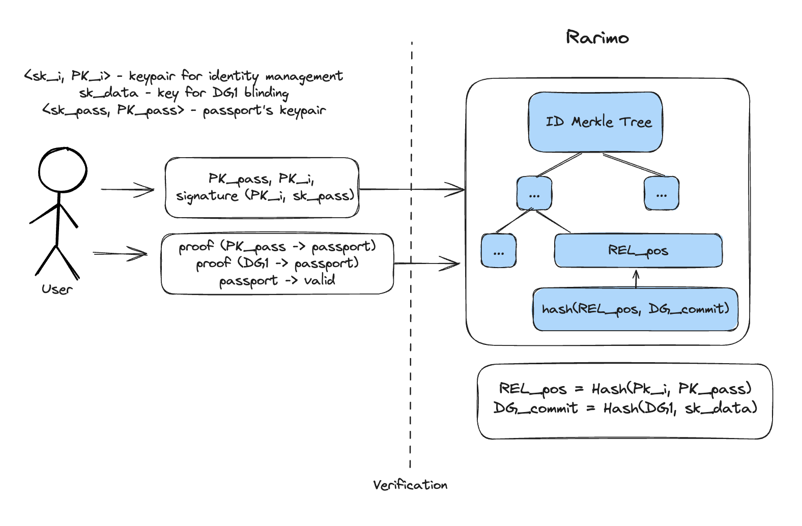
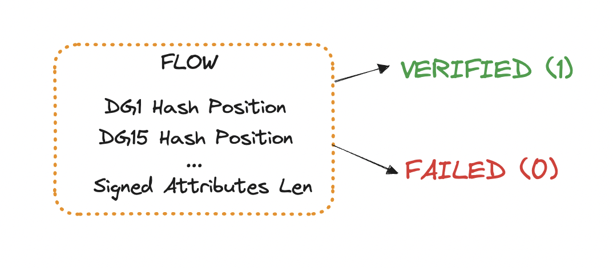
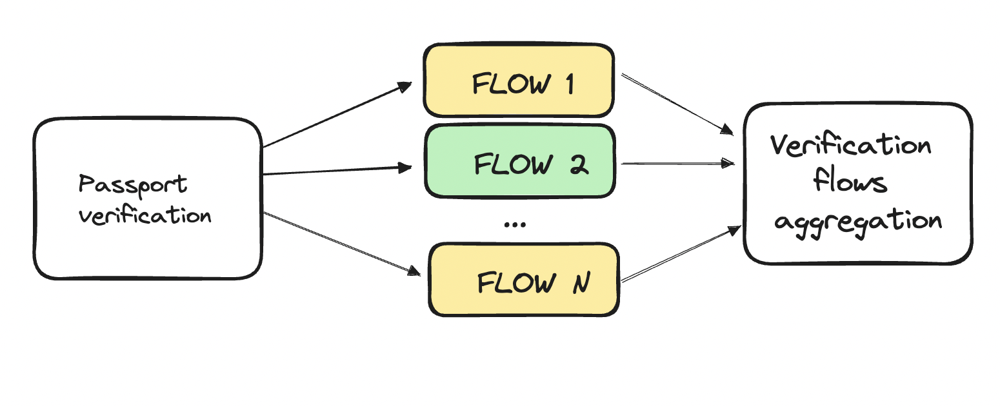
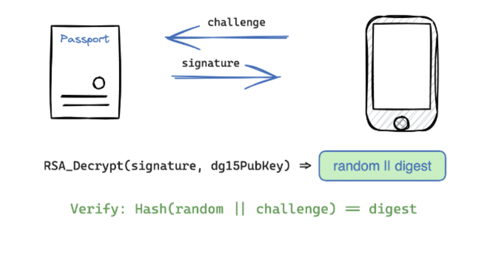
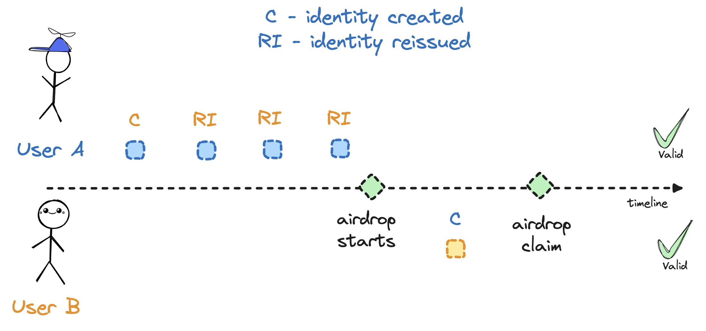

# passport-zk-circuits

Circuits for a voting system based on the passport scanning

Install the `circomlib` package before running the circuits.

```console
npm install circomlib
```

**scripts** directory contains scripts to simplify interaction with circuits.

- ***compile-circuit*** - compiles circom circuit (receive *R1CS*, *WASM* & *CPP* for witness generation);  Usage: ```compile-circuit <circuit_name>```
  
- ***trusted-setup*** - *Powers-of-Tau* ceremony for trusted setup generation. Usage: ```trusted-setup <power>```
  
- ***export-keys*** - generates proving and verification keys. Do not forget to perform a trusted setup first. Usage: ```export-keys <circuit_name> <power>```

- ***gen-witness*** - generates witness. Can be done without a trusted setup. Do not forget to compile circuit first. Usage: ```gen-witness <circuit_name> <inputs>```

- ***prove*** - generates witness and proof. Do not forget to compile the circuit and export keys first. Usage: ```prove <circuit_name> <inputs>```

- ***verify*** - verifies the proof. Usage: ```verify <circuit_name>```

##

[](https://github.com/dl-solarity/hardhat-zkit)

## Biometric Passport Authentication

Data in a passport is separated into data groups. Not all of them are required to be present in the passport. Document Security Object (SOD) has **encapculated content** field that contains hashes of all datagroups. During passive authentication verification party hashes data from the datagroups and compare it with hashes stored in the **encapculated content** with *ASN1* encoding. The hash of the **encapculated content** itself is stored in the **signed attributes** field, which is also *ASN1* encoded.
To verify **signed attributes**, verification party uses the passport signature, which is also stored in the **SOD**. To confirm that the passport is authenticated by a legitimate authority (ensuring the signer's public key is genuinely owned by a passport-issuing entity), the corresponding **PKI x509** certificate is stored in the **SOD**. Utilizing a Public Key Infrastructure (PKI) allows for the establishment of a verification path to a trusted anchor. This trusted anchor should be a publicly recognized list of master certificates. Specifically, a *Master List* comprises *Country Signing Certification Authority (CSCA)* certificates that have been issued and digitally signed by the respective issuing State, providing a robust framework for ensuring the authenticity and integrity of passport data.

## Circuits

### Voting circuits

Voting circuits are used to prove that the user has registered for the voting. Technically, it is used to prove that the user knows the preimage of the leaf in the Merkle Tree.

The Merkle Tree is built upon participants registration. After proving that the user is eligible to vote, `commitment` is added to the tree.

*commitment = Poseidon(nullifier, secret)*.

By using the knowledge of the commitment preimage and generating the corresponding proof, users can express their votes.

#### Circuit parameter

**depth** - depth of a Merkle Tree used to prove leaf inclusion.

#### Inputs

- ***root***: *public*; Poseidon Hash is used for tree hashing;

- ***nullifierHash***: *public*; Poseidon Hash is used for the *nullifier* hashing;

- ***vote***: *public*; not taking part in any computations; binds the vote to the proof

- ***nullifier***: *private*

- ***secret***: *private*

- ***pathElements[levels]***: *private*; Merkle Branch

- ***pathIndices[levels]***: *private*; `0` - left, `1` - right

### Passport Verification circuits

Passport Verification circuits are used to prove that user is eligible to vote. Currently following checks are made:

- Date of passport expiracy is less than the current date;

- Current date is after date of birth + **18** years; (for now **18** years is a constant);

- Passport issuer code is used as an output signal;

### Circuit public inputs

- **currentDateYear**

- **currentDateMonth**

- **currentDateDay**

- **credValidYear**

- **credValidMonth**

- **credValidDay**

- **ageLowerbound** - age limit for voting rights. The circuit verifies that the passport owner is older than *ageLowerbound* years at the *currentDate*.

### Circuits private inputs

- **in** - passport **DG1** serialized in binary.

The current date is needed to timestamp the date of proof generation. The circuit proves that at this date, the user is eligible to vote (and will be eligible by the protocol rules at least until the credValid date).

Passport data is separated into *DataGroups*. The hashes of these datagroups are stored in **SOD** *(Security Object of the Document)*. All neccesary data is stored in *Data Group 1 (DG1)*. Currently, **SHA1** and **SHA256** hashes are supported (```passportDG1VerificationSHA256``` and ```passportDG1VerificationSHA256```).

### Testing

To run tests enter ***tests*** directory and run:

```mocha -p -r ts-node/register 'passportTests.js'```

Inputs are not provided, as they contain personal data. May be mocked later.

To test query circuits:
```mocha -p -r ts-node/register 'queryIdentityTests.js'```

To test identity registration circuits:
```mocha -p -r ts-node/register 'registerIdentityTests'.js'```

### Identity platform

To enhance user experience and eliminate the repetitive need for passport rescanning, we have implemented a user identity management platform. This platform streamlines the process, making it easier and more efficient for users to verify their identity.

The core concept involves linking a unique identity key pair to each passport. This allows users to utilize these identity keys to swiftly and securely verify their information without the need for constant passport rescanning.



The Sparce Merkle Tree, containing the ***identity state*** (which identity connected to which passport) in stored on-chain, allowing to generate ZK proofs.

#### Register Identity Circuit

To link an identity with a passport, we utilize the ***registerIdentity*** circuits. At present, we employ the ***registerIdentityUniversal*** circuit. This mechanism enables the complete passport verification process and establishes that a specific active authentication public key is associated with a valid passport, all while maintaining the confidentiality of the passport owner's personal information.

***registerIdentityUniversal*** circuit is compiled with different parameters in order to support different signing algorithms. Currently we support ```RSA 2048``` and ```RSA 4096``` bits.

Passports from different countries often vary in structure, and even within the same country, not all passports are identical. This variability can pose a challenge, as the verification circuits rely on a strict and precise algorithm. Even a minor discrepancy, such as a shift by a single byte, can disrupt the entire verification process, rendering it ineffective.

To address these challenges, we employ a combination of verification flow and padded data hashing.

##### Padded data hashing

Padded data hashing enables the data padding to be handled outside the circuit. This approach offers several benefits:

- ***Reduced Complexity***: By performing the padding outside the circuit, we reduce the number of constraints the circuit must manage.
- ***Increased Flexibility***: This method allows for accommodating variations in passport structure without disrupting the strict verification process.  

To illustrate, let's consider the need to hash **2688** bits of data using the SHA-256 algorithm. If we directly use `SHA256(2688)`, it will only process exactly **2688** bits. However, if we need to hash **2704** bits, we would have to instantiate a new function, `SHA256(2704)`, leading to a significant increase in constraints.

`SHA` hashing functions operates by dividing data into blocks (`512-bit` for `SHA256`) and applying padding to complete any remaining bits. So both **2688** bits and **2704** bits will be hashed as **512 bits * 6 blocks = 3072 bits**. We used `sha256NoPadding.circom` which is not adding padding to inputs. With this approach both cases can be handled with the same circuit, which allows us to handle small changes in passport structure without adding a lot of new constraints.

##### Passport Verification Flows

For now we encountered several differences between passports:

- different DG15 size;
- different datagroup hash positions in the encapsulated content;
- different encapsulated content size (and present datagroups);
- different encapsulated content hash position in signed attributes;
- different signed attributes size;
- different signature and hashing algorithms;

For different signature & hashing algorithm currently we are using different circuits, as merging all logic into one circuit makes it too complex to run on mobile devices.

Other differences are handled using `VerificationFlows`. It allows to generate a specific verification circuit using by setting required parameters. Verification circuit returs either ***0*** or ***1*** (***failed***/***successfull*** verification);



Those verification flows than combined and verified that at least one of them was successful.



##### Different active authentication

Active authentication is a procedure that allows you to verify the validity of the chip and makes it much more difficult to copy a biometric chip. The idea behind the active auth is signing a random challange with passport private key that is securely stored within the secure module and never leaves passport. This secure module operates by receiving a challenge, signing it, and then returning the signed challenge. The authenticity of this signature can be verified using a public key, which is stored within Data Group 15 (DG15) of the passport's chip.



Some biometric passports either don`t have an active authentication or have different signature and/or hashing algorithm. Currently, the active authentication signature verification is handled by the smart contract, while circuits prove that a specific public key is present into a valid passport.

`registerIdentityUniversal` circuit has `dg15PubKeyHash` and `passportHash` output signals. In case scanned passport does not have an active authentication, generated proof will have `passportHash` set with  
Poseidon(SHA256(signed_attributes\[:252bits])), while `dg15PubKeyHash` will be set to `0`. Otherwise (if passport have an active auth) `dg15PubKeyHash` will contain hash of passport public key, while `passportHash` is set to `0`.

*How active auth public key is hashed?*

`RSA (1024 bit) case`: ***Poseidon5(200, 200, 200, 200, 224bits)***

`ECDSA (256 bit field) case`: ***Poseidon2(X\[:31bytes], Y\[:31bytes])***

##### Register identity circuit inputs

```json
{
    "skIdentity": "123405...842587619674072055", // identity secret key
    "encapsulatedContent": [0, 1, 0],            // passport encapsulated content in binary
    "signedAttributes": [0, 1, 0],               // signed attributes in binary
    "sign": ["64bit", "64bit..."],               // signature in 64 bit blocks
    "modulus": ["64bit", "64bit..."],            // modulus in 64 bit blocks
    "dg1": [0, 1, 0],                            // passport DG1 in binary
    "dg15": [0, 1, 0],                           // passport DG15 in binary
    "slaveMerkleRoot": "0x..", // root of the sparse Merkle tree with 2nd level keys (PUBLIC)
    "slaveMerkleInclusionBranches": ["0x", "0x...", "0x"] // inclusion proof
}
```

##### Register identity circuit public signals

- [0] **output** dg15PubKeyHash;
- [1] **output** passportHash;
- [2] **output** dg1Commitment;
- [3] **output** pkIdentityHash;
- [4] **input** slaveMerkleRoot;   // public

#### Query circuit

The query circuit allows you to prove arbitrary data from a passport.

##### Query circuit inputs

```json
{
  "dg1": [0, 1, 0, .... 1, 0], // 744 bits, DG1 in binary representation
  "eventID": "304358862882731539112827930982999386691702727710421481944329166126417129570",
  "eventData": "1217571210886365587192326979343136122389414675532",
  "idStateRoot": "5904469035765435216409767735512782299719282306270684213646687525744667841608",
  "idStateSiblings": [
    "3407986854548047084674816477222999918010365460020671033967657162352688012776",
    "0",
    "0",
    ...
    "0",
    "0",
  ], // Sparse Merkle tree (identity state tree), depth = 80
  "pkPassportHash": "158067046276207(hidden)9045233186516590845",
  "selector": "39",
  "skIdentity": "59433543291003015964215(hidden)50571872045447542665233394",
  "timestamp": "1713436475",
  "identityCounter": "0",
  "timestampLowerbound": "0",
  "timestampUpperbound": "0",
  "identityCounterLowerbound": "1",
  "identityCounterUpperbound": "0",
  "birthDateLowerbound": "0x303030303030",
  "birthDateUpperbound": "0x303030303030",
  "expirationDateLowerbound": "0x303030303030",
  "expirationDateUpperbound": "0x303030303030",
  "citizenshipMask": "0"
}
```

***IMPORTANT!***

If date input is **NOT** used, put “0x303030303030” (52983525027888 - decimal). This is equal to “000000” in UTF-8 encoding, which is used to encode date in the passport. Otherwise date verification constraints will fail.

Public signals (example for selector = 39)

```json
[
 "20925303098627062266630214635967906856225360340756326562498326001746719100911", // 0 - nullifier
 "52992115355956", // 1 - birthDate
 "55216908480563", // 2 - expirationDate
 "0", // 3 - name
 "0", // 4 - nameResidual
 "0", // 5 - nationality
 "5589842", // 6 - citizenship
 "0", // 7 - sex
 "0", // 8 - documentNumber
 "304358862882731539112827930982999386691702727710421481944329166126417129570", // 9 - eventID
 "1217571210886365587192326979343136122389414675532", // 10 - eventData
 "5904469035765435216409767735512782299719282306270684213646687525744667841608", // 11 - idStateRoot
 "39", // 12 - selector
 "0", // 13 - timestampLowerbound
 "0", // 14 - timestampUpperbound
 "1", // 15 - identityCounterLowerbound
 "0", // 16 - identityCounterUpperbound
 "52983525027888", // 17 - birthDateLowerbound
 "52983525027888", // 18 - birthDateUpperbound
 "52983525027888", // 19 - expirationDateLowerbound
 "5298352502788", // 20 - expirationDateUpperbound
 "0" // 21 - citizenshipMask
]
```

***Selector***

By applying the selector, we can use the same circuit for any set of revealed and unrevealed personal data.

```markdown
QUERY SELECTOR:
0 - nullifier   (+)
1 - birth date  (+)
2 - expiration date (+)
3 - name (+)
4 - nationality (+)
5 - citizenship (+)
6 - sex (+)
7 - document number (+)
8 - timestamp lowerbound (+)
9 - timestamp upperbound (+)
10 - identity counter lowerbound (+)
11 - identity counter upperbound (+)
12 - passport expiration lowerbound (+)
13 - passport expiration upperbound (+)
14 - birth date upperbound (+)
15 - birth date lowerbound (+)
16 - verify citizenship mask as a whitelist (-) // not implemented currently
17 - verify citizenship mask as a blacklist (-) // not implemented currently
```

Example:

You want to reveal **`*citizenship*`** and **`*nullifier*`** + prove that `identity counter` is **`*LESS THAN 2*`**, selector bits number 0, 5 and 11 should be active. Thus, ***selector*** will be equal:

***0b000100000100001 = 0x811 = 2065***

! You should also put `2` in the `identityCounterUpperbound` input signal.

For 0-7 selector ***REVEALS*** the data (the corresponding public signal will be set to the exact value, like `nationality`)

for 8-17 selector proves that the corresponding parameters are in a specific range (set), which is set with public signals (like `identityCounterLowerbound` / `Upperbound`). If selector is active (`1`) and data is not within the provided range, prove generation will fail. If selector is disabled (`0`), data will not be verified and prove can be generated with any data (be careful with dates)

***Nullifier***

The nullifier is used in order to prevent user from participating in some event multiple times.

***nullifier*** = *Poseidon3(sk_i, Poseidon1(sk_i), eventID)*

The nullifier can be bypassed by reissuing the identity. One way to solve this problem is by fixing the identity state (thus no one can reissue the new identity). Another approach is described in **Using the query circuit for an airdrop**

***EventId***

The eventId is used to generate different nullifiers by the same identity for different use cases (events). Current event constants:

Airdrop: `0xac42d1a986804618c7a793fbe814d9b31e47be51e082806363dca6958f3062`

Points: `0x77fabbc6cb41a11d4fb6918696b3550d5d602f252436dd587f9065b7c4e62b`

##### Using query circuit for an airdrop

Identity V2 allows to generate anonymous ZK queries, without revealing any personal data about the user. Nullifier is query could potentially be used in order to prevent users from receiving airdrops multiple times.

But if no additional restrictions are added to the system, the user can reissue the identity several times, each time receiving a new identity (with a new nullifier). Thus, user could potentially get airdrop multiple times. б

Identity V2 allows to prove identity creation timestamp and identity counter (how many time identity have been reissued to a specific user). To prevent users from getting the airdrop multiple times, two additional constraints should be set up:

- The current identity was created before the airdrop started;
- The user has never reissued the identity;



If one of the following conditions have been met, user could receive the airdrop. With such an airdrop system, the users could receive an airdrop only if their identity have not being reissued during the airdrop period.

### **How to check both eligibility criteria with a single query proof**?

Constraints for both `*identityCounterUpperbound`* and *`timestampUpperbound` should be active (selector 9 & 11). Client (mobile app) choses the*  ****eligibility criteria:

- If user is eligible by `timestamp`, but he had 5 identity reissues, prove constraints should be follows:
  - `*timestampUpperbound` ==  `airdropStartsTimestamp`*
  - `*identityCounterUpperbound` < 10 (any number, that is greater the identityCounter)*

- If user is eligible by `identityCounter`, but have created the identity after the airdrop started, prove constraints should be follows:
  - `*timestampUpperbound` == `randomTimestamp` ( `randomTimestamp` > `timestamp`)*
  - `*identityCounterUpperbound` < 1 (first identity creation)*

When the verification party (backend or smart contract) receives the proof, they check that any condition have been met:

- `*timestampUpperbound` ==  `airdropStartsTimestamp`*
- `*identityCounterUpperbound` < 1*

### Verifying that user is eligible

- Passport has not expired
  - `passportExpiration` > `currentDate`
  - `passportExpirationLowerbound` is set to `currentDate`
- User is older than 18 y. o.
  - `birthDate` < `currentDate` - 18 (years)
  - `birthDateUpperbound` is set to `currentDate` - 18 (years)

### **Selector**

**Revealed:**

- *nullifier*
- *citizenship (5)*

**Constraints:**

- *timestamp upperbound (9)*
- *identity counter upperbound (11)*
- *passport expiration lowerbound (12)*
- *birth date upperbound (14)*

**Selector:**

- Binary: *0b101101000100001*
- Decimals: *23073*
